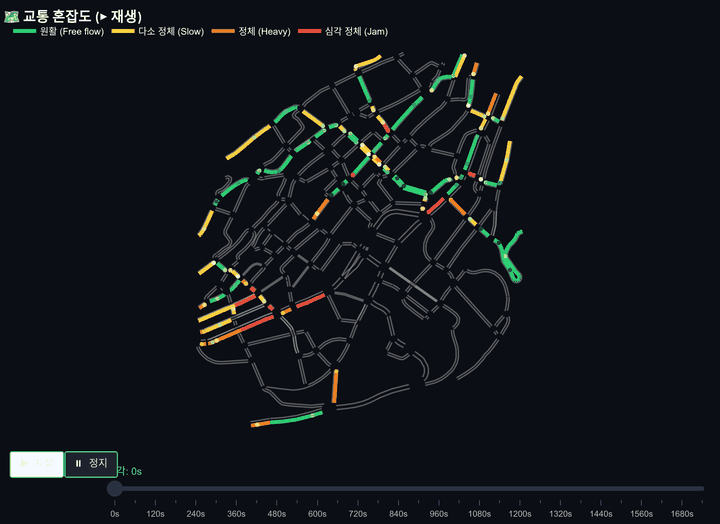
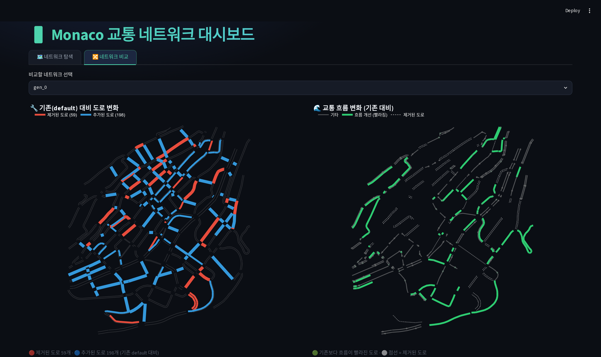

# 🚦 Monaco 교통 네트워크 대시보드

**생성 모델(Generative Model)로 설계한 도로망 최적화 결과**를 시각화하는 인터랙티브 대시보드입니다.

도로망 레이아웃과 교통 성능(평균 대기시간) 데이터로 학습한 **이산 생성 모델
(Discrete Flow Matching + Discrete Guidance)** 이, 혼잡이 줄어드는 방향으로
새로운 도로망을 **생성**합니다. 이 대시보드는 생성 모델이 설계한 도로망의 혼잡도와,
기존 도로망(`default`) 대비 교통 흐름이 어떻게 개선되는지를 한눈에 보여 줍니다.

| 탭 | 내용 |
|----|------|
| 🗺️ **네트워크 탐색** | 도로망을 선택하면 왼쪽에 혼잡도 지도(🟢 원활 → 🔴 정체)가 표시되고 ▶ 재생 버튼으로 시간에 따른 혼잡 변화를 애니메이션으로 볼 수 있습니다. 오른쪽에는 대기/주행/지연 시간 등 지표가 정리됩니다. |
| 🔀 **네트워크 비교** | 기존(`default`) 대비 생성 모델이 🔴 제거한 도로 / 🔵 추가한 도로를 보여 주고, 그로 인한 교통 흐름 개선(🟢)을 시각화합니다. |

## 방법 개요

1. **데이터 수집** — 다양한 도로망 레이아웃을 SUMO로 시뮬레이션해
   `(레이아웃, 평균 대기시간)` 데이터셋을 만듭니다.
2. **생성 모델 학습** — 레이아웃을 생성하는 **Discrete Flow Matching** 모델과,
   레이아웃으로부터 대기시간을 예측하는 **predictor**를 함께 학습합니다.
3. **유도 생성(Guided Generation)** — predictor의 그래디언트로 샘플링을 유도해
   **대기시간이 낮은(혼잡이 적은) 도로망**을 생성합니다.
4. **평가 & 시각화** — 생성된 도로망을 다시 SUMO로 시뮬레이션해 성능을 검증하고,
   그 결과를 이 대시보드로 시각화합니다.

> 생성 모델 학습·샘플링 전체 파이프라인은 연구 본 저장소(`discrete_guidance/`)에 있으며,
> 이 저장소는 그 **결과물을 재현·시각화**하는 데 초점을 둡니다.

---

## 미리보기

### 🗺️ 네트워크 탐색 — 시간에 따른 혼잡도 애니메이션
▶ 재생 버튼을 누르면 시뮬레이션 시간에 따라 도로 혼잡이 번지는 모습을 볼 수 있습니다.



### 🔀 네트워크 비교 — 도로 변화 & 교통 흐름
왼쪽: 기존 대비 🔴 제거 / 🔵 추가된 도로 · 오른쪽: 흐름이 빨라진 도로(🟢)



> 데모에 포함된 `gen_0`~`gen_4`는 **생성 모델이 설계한 도로망**(평균 대기시간이
> 가장 낮게 평가된 상위 5개)입니다. 모두 기존(`default`) 대비 도로를 일부 제거하고
> 일부 추가하면서 혼잡을 줄였습니다.

| 도로망 | 제거 도로 | 추가 도로 | 도착 차량 | 평균 대기시간 |
|--------|----------|----------|----------|--------------|
| 기존 (default) | — | — | 191 | 521.6 s |
| gen_0 | 59 | 198 | 737 | **403.8 s** |
| gen_1 | 73 | 187 | 785 | 423.5 s |
| gen_2 | 60 | 207 | 968 | 484.9 s |
| gen_3 | 52 | 203 | 787 | 434.0 s |
| gen_4 | 54 | 200 | 838 | 477.6 s |

<sub>SUMO 1800초 시뮬레이션, 교통 수요 `default_dense.rou.xml` 동일 적용 기준.</sub>

---

## 빠른 실행 (사전 생성된 데이터 사용 — SUMO 불필요)

저장소에 시뮬레이션 결과(`results/Monaco/dashboard/dashboard_data.pkl`)가
포함되어 있어, 별도 시뮬레이션 없이 바로 실행할 수 있습니다.

```bash
# 1) (권장) 가상환경 생성
python -m venv .venv && source .venv/bin/activate
#    또는: conda create -n monaco-dashboard python=3.10 && conda activate monaco-dashboard

# 2) 의존성 설치
pip install -r requirements.txt

# 3) 대시보드 실행
streamlit run dashboard.py
```

브라우저에서 자동으로 열리지 않으면 터미널에 표시되는 `http://localhost:8501`
주소로 접속하세요. 원격 서버에서 실행 중이라면 SSH 포트포워딩을 사용합니다:

```bash
ssh -L 8501:localhost:8501 <서버주소>
```

---

## 데이터 재생성 (선택 — SUMO 필요)

대시보드 데이터(`dashboard_data.pkl`)를 직접 다시 만들려면 [Eclipse SUMO](https://eclipse.dev/sumo/)
(`sumo`, `netconvert` 바이너리)와 추가 패키지가 필요합니다.

```bash
# SUMO 설치 (예: Ubuntu)
sudo apt-get install sumo sumo-tools
export SUMO_HOME=/usr/share/sumo

# 추가 파이썬 패키지
pip install networkx sumolib traci matplotlib tqdm
```

**(A) 생성 모델 도로망으로 대시보드 데이터 만들기** — 이 저장소에 포함된 생성
네트워크(`sumo/Monaco/generative/*.net.xml`)를 기존 네트워크와 함께 시뮬레이션합니다:

```bash
python collect_dashboard_from_nets.py \
  --nets sumo/Monaco/generative/gen_35_seed42.net.xml \
         sumo/Monaco/generative/gen_78_seed42.net.xml \
         sumo/Monaco/generative/gen_20_seed42.net.xml \
         sumo/Monaco/generative/gen_37_seed42.net.xml \
         sumo/Monaco/generative/gen_61_seed42.net.xml \
  --names gen_0 gen_1 gen_2 gen_3 gen_4 \
  --simulation_time 1800 --period 60
```

**(B) 생성 모델 자체를 다시 학습/생성** — Discrete Flow Matching 모델 학습부터
유도 생성까지의 전체 파이프라인은 연구 본 저장소(`discrete_guidance/`)에 있습니다.
요약하면: `data_collection_monaco.py`로 `(레이아웃, 대기시간)` 데이터셋 수집 →
`train.py -m all`로 DFM + waiting_time predictor 학습 →
`generate.py -p waiting_time=<목표값>`으로 유도 생성 →
`sample_check_monaco.py`로 SUMO 평가 후 `sumo/Monaco/gen_*.net.xml` 저장.
저장된 net.xml을 위 (A) 명령에 넣으면 대시보드로 시각화됩니다.

> 참고용으로 무작위 도로망 데이터를 만드는 `collect_dashboard_data.py`도 포함되어
> 있습니다(`collect_dashboard_from_nets.py`가 공유 시뮬레이션 함수를 여기서 가져옵니다).

---

## 구조

```
monaco-dashboard/
├── dashboard.py                    # Streamlit 대시보드 (메인 산출물)
├── collect_dashboard_from_nets.py  # 생성 모델 net.xml → 대시보드 데이터
├── collect_dashboard_data.py       # 공유 시뮬레이션 유틸 / 무작위 베이스라인
├── data_collection_monaco.py       # 네트워크 생성 유틸
├── docs/                           # README용 미리보기 (GIF/PNG)
├── requirements.txt
├── .streamlit/config.toml          # 다크 테마 설정
├── sumo/Monaco/
│   ├── default.net.xml             # 기존(원본) 네트워크
│   ├── default_dense.net.xml       # 도로망 후보 공간(조밀 네트워크)
│   ├── default_dense.rou.xml       # 교통 수요(라우트)
│   ├── eternal_edges.pkl           # 제거 불가 도로 캐시
│   └── generative/                 # 생성 모델이 설계한 도로망 (데모용 5개)
│       └── gen_*_seed42.net.xml
└── results/Monaco/dashboard/
    └── dashboard_data.pkl          # 사전 생성된 시뮬레이션 결과
```

## 동작 원리 (요약)

- 각 도로(edge)의 **혼잡도 = 평균 주행속도 ÷ 제한속도** (1에 가까울수록 원활).
- SUMO의 `edgeData` 출력을 시간대별로 집계해 색으로 표현합니다.
- 비교 탭의 흐름 변화는 동일한 교통 수요(`default_dense.rou.xml`)로
  기존 네트워크와 변형 네트워크를 각각 시뮬레이션해 도로별 혼잡도 차이를 계산합니다.
